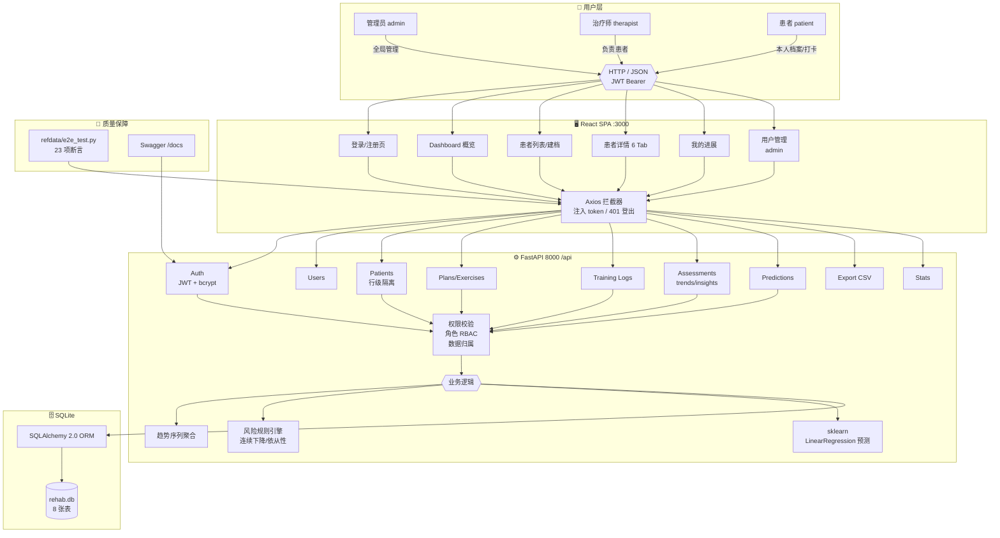
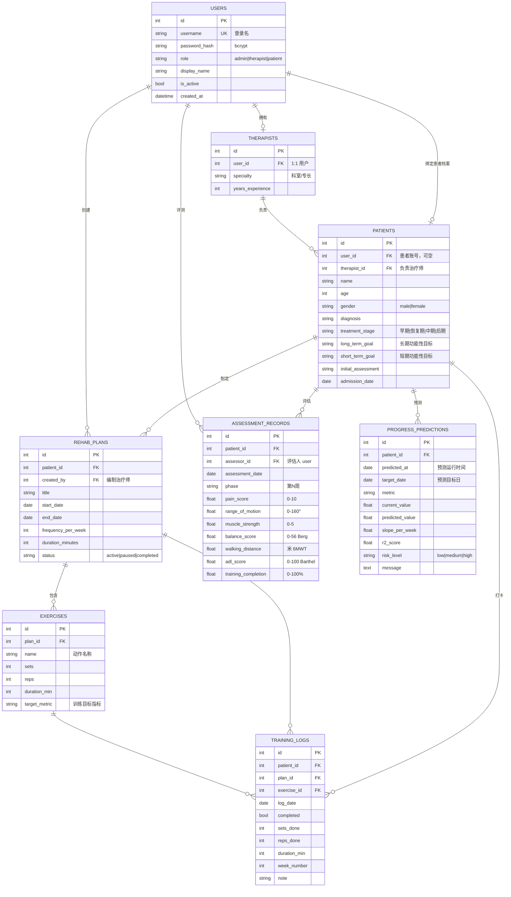

# 系统架构图 & 数据库 ER 图

> Mermaid 图可直接在 GitHub / VS Code (Markdown Preview Mermaid Support) 中渲染。
> 独立 SVG/PNG：可在 https://mermaid.live 粘贴源码导出。

---

## 一、系统架构图

**关键流程（预测）**：`前端预测页 → POST /predictions/patient/{id}?weeks_ahead=4 → 读取该患者评估序列 → 每个指标按周次拟合 LinearRegression → 外推 + 临床上下限裁剪 + 风险分级 → 落库并返回 → 前端渲染预测表/风险徽章`。

---

## 二、数据库 ER 图（8 张表）

---

## 三、指标定义（临床参考值）

| 指标 | 字段 | 范围 | 方向 | 临床依据 |
|---|---|---|---|---|
| 疼痛评分 | `pain_score` | 0–10 **整数** | 越低越好 | NRS 数字评分法（0 无痛，10 剧痛）；变化 ≥2 分（MCID）才有统计学意义 |
| 关节活动度 | `range_of_motion` | 0–180° **整数** | 越高越好 | 测角器读数；膝关节屈曲参考目标 ≥120° |
| 肌力 | `muscle_strength` | 0–5 **整数** | 越高越好 | MMT 徒手肌力分级 |
| 平衡 | `balance_score` | 0–56 **整数** | 越高越好 | Berg 平衡量表（≥45 低跌倒风险） |
| 步行距离 | `walking_distance` | 米 **整数** | 越高越好 | 6 分钟步行试验（健康老人 400–700m）；**TKA 等术后早期（前约 4 周）不测**，可留空 |
| 日常生活 | `adl_score` | 0–100 **整数** | 越高越好 | Barthel 巴氏指数（100 = 完全自理） |
| 完成率 | `training_completion` | 0–100% | 越高越好 | **自动**：当周完成打卡数 ÷ 当周总打卡数 ×100%（自然周年一~周日，无打卡为空） |
| 综合恢复指数 | `composite_score` | 0–100 | 越高越好 | 各已记录指标按量表范围归一化（疼痛反向）取平均 ×100，后端计算 |

> 7 项评估指标均为整数量表（Schema 强制，小数提交 422）；数据库 Integer 列。趋势图/下拉菜单均标注量表名。

> 参考规则来自世卫组织/康复循证文献（详见 `refdata/` 下抓取的维基百科临床量表资料）。